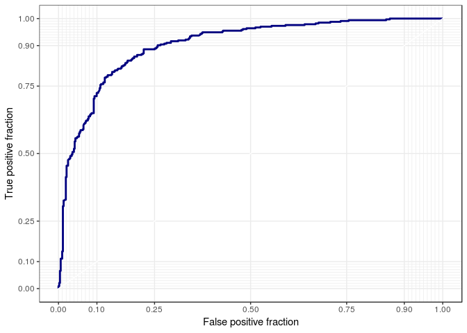
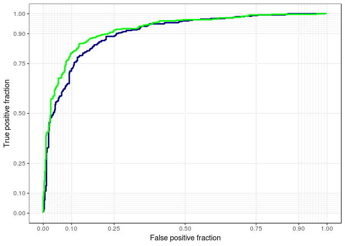

Untitled
================
Yi Liu
3/8/2019

1.  This question refers to Chapter 9 Problem 8 beginning on page 371 in the text.

    1.  Create a training sample that has roughly 80% of the observations. Use `set.seed(19823)`.

``` r
set.seed(19823)
df <- tbl_df(OJ)
inTraining <- createDataPartition(df$Purchase, p = .80, list = F)
training <- df[inTraining, ]
testing  <- df[-inTraining, ]
```

    b. Use the `kernlab` package to fit a support vector classifier to the 

training data using `C = 0.01`.

``` r
OJ_svc <- ksvm(Purchase ~ ., data = training,
               type = "C-svc", 
               kernel = 'vanilladot',
               C = 0.01,
               prob.model = TRUE)
```

    ##  Setting default kernel parameters

    c. Compute the confusion matrix for the training data. Report the overall 

error rates, sensitivity, and specificity.

``` r
confusionMatrix(table(predict(OJ_svc, newdata = testing), testing$Purchase), positive = "MM")
```

    ## Confusion Matrix and Statistics
    ## 
    ##     
    ##       CH  MM
    ##   CH 117  24
    ##   MM  13  59
    ##                                           
    ##                Accuracy : 0.8263          
    ##                  95% CI : (0.7686, 0.8746)
    ##     No Information Rate : 0.6103          
    ##     P-Value [Acc > NIR] : 7.121e-12       
    ##                                           
    ##                   Kappa : 0.6258          
    ##  Mcnemar's Test P-Value : 0.1002          
    ##                                           
    ##             Sensitivity : 0.7108          
    ##             Specificity : 0.9000          
    ##          Pos Pred Value : 0.8194          
    ##          Neg Pred Value : 0.8298          
    ##              Prevalence : 0.3897          
    ##          Detection Rate : 0.2770          
    ##    Detection Prevalence : 0.3380          
    ##       Balanced Accuracy : 0.8054          
    ##                                           
    ##        'Positive' Class : MM              
    ## 

    d. Construct the ROC curve. 

``` r
fits_svc <- predict(OJ_svc, newdata = training, type = "probabilities")
svc_pred <- mutate(training, 
                   svc_probs = fits_svc[, 2],
                   default = if_else(Purchase == "MM", 1, 0))
p <- ggplot(data = svc_pred, aes(d = default, m = svc_probs))
p + geom_roc(n.cuts = 0, col = "navy") + style_roc()
```

 e. Use the `train` function from the `caret` package to find an optimal cost parameter (`C`) in the range 0.01 to 10. Use `seq(0.01, 10, len = 20)`.

``` r
fit_control <- trainControl(method = "repeatedcv",
                            number = 10, 
                            repeats = 3)
OJ_train <- train(Purchase ~ ., data = training,
                  method = "svmLinear", 
                  trControl = fit_control,
                  tuneGrid = data.frame(C = seq(0.01, 10, len=20)))
```

    f. Compute the training and test classification error.

``` r
confusionMatrix(table(predict(OJ_train, newdata = training), training$Purchase), positive = "MM")
```

    ## Confusion Matrix and Statistics
    ## 
    ##     
    ##       CH  MM
    ##   CH 462  72
    ##   MM  61 262
    ##                                           
    ##                Accuracy : 0.8448          
    ##                  95% CI : (0.8188, 0.8684)
    ##     No Information Rate : 0.6103          
    ##     P-Value [Acc > NIR] : <2e-16          
    ##                                           
    ##                   Kappa : 0.6718          
    ##  Mcnemar's Test P-Value : 0.3859          
    ##                                           
    ##             Sensitivity : 0.7844          
    ##             Specificity : 0.8834          
    ##          Pos Pred Value : 0.8111          
    ##          Neg Pred Value : 0.8652          
    ##              Prevalence : 0.3897          
    ##          Detection Rate : 0.3057          
    ##    Detection Prevalence : 0.3769          
    ##       Balanced Accuracy : 0.8339          
    ##                                           
    ##        'Positive' Class : MM              
    ## 

``` r
confusionMatrix(table(predict(OJ_train, newdata = testing), testing$Purchase), positive = "MM")
```

    ## Confusion Matrix and Statistics
    ## 
    ##     
    ##       CH  MM
    ##   CH 114  20
    ##   MM  16  63
    ##                                           
    ##                Accuracy : 0.831           
    ##                  95% CI : (0.7738, 0.8787)
    ##     No Information Rate : 0.6103          
    ##     P-Value [Acc > NIR] : 2.296e-12       
    ##                                           
    ##                   Kappa : 0.6415          
    ##  Mcnemar's Test P-Value : 0.6171          
    ##                                           
    ##             Sensitivity : 0.7590          
    ##             Specificity : 0.8769          
    ##          Pos Pred Value : 0.7975          
    ##          Neg Pred Value : 0.8507          
    ##              Prevalence : 0.3897          
    ##          Detection Rate : 0.2958          
    ##    Detection Prevalence : 0.3709          
    ##       Balanced Accuracy : 0.8180          
    ##                                           
    ##        'Positive' Class : MM              
    ## 

    g. Repeat (b) - (d) using an SVM with a polynomial kernel with degree 2. 

``` r
OJ_svc_poly <- ksvm(Purchase ~ ., data = training,
               type = "C-svc", 
               kernel = 'polydot',
               kpar = list(degree = 2, scale = .1),
               C = 1,
               prob.model = TRUE)
fits_svm_d2 <- predict(OJ_svc_poly, newdata = training, 
                       type = "probabilities")
svc_pred_d2 <- mutate(svc_pred, svc_probs_d2 = fits_svm_d2[, 2])
confusionMatrix(table(predict(OJ_svc_poly, newdata = testing), testing$Purchase), positive = "MM")
```

    ## Confusion Matrix and Statistics
    ## 
    ##     
    ##       CH  MM
    ##   CH 115  25
    ##   MM  15  58
    ##                                           
    ##                Accuracy : 0.8122          
    ##                  95% CI : (0.7532, 0.8623)
    ##     No Information Rate : 0.6103          
    ##     P-Value [Acc > NIR] : 1.758e-10       
    ##                                           
    ##                   Kappa : 0.5964          
    ##  Mcnemar's Test P-Value : 0.1547          
    ##                                           
    ##             Sensitivity : 0.6988          
    ##             Specificity : 0.8846          
    ##          Pos Pred Value : 0.7945          
    ##          Neg Pred Value : 0.8214          
    ##              Prevalence : 0.3897          
    ##          Detection Rate : 0.2723          
    ##    Detection Prevalence : 0.3427          
    ##       Balanced Accuracy : 0.7917          
    ##                                           
    ##        'Positive' Class : MM              
    ## 

``` r
svc_pred_d2 <- mutate(svc_pred, svc_probs_d2 = fits_svm_d2[, 2])
fits_svc_poly <- predict(OJ_svc_poly, newdata = training, type = "probabilities")
svc_pred_poly <- mutate(svc_pred, 
                   svc_probs_poly = fits_svc_poly[, 2])
p <- ggplot(data = svc_pred_poly, aes(d = default, m = svc_probs))
p + geom_roc(n.cuts = 0, col = "navy") + 
  geom_roc(aes(d = default, m = svc_probs_poly), n.cuts = 0, col = "green") +
  style_roc()
```



    h. Which method would you choose?

    i. Repeat (b) - (d) using an SVM with a radial basis kernel. Train it. 
    j. Using the best models from LDA, SVC, SVM (poly), and SVM (radial), 
    compute the test error. 
    k. Which method would you choose?

1.  Train one of the SVM models using a single core, 2 cores, and 4 cores. Compare the speedup (if any).
2.  You might want to look at `rbenchmark` or `microbenchmark` packages for timing.
